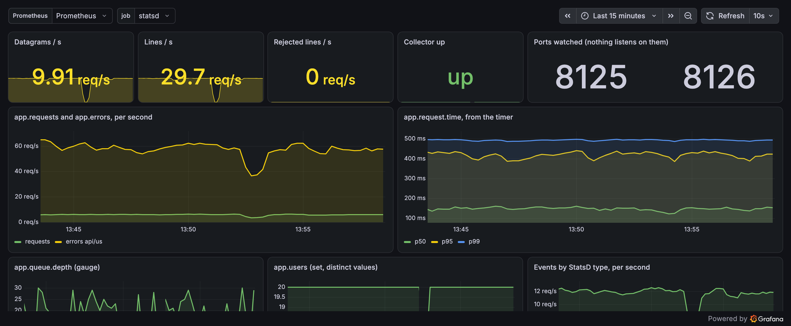

# statsd_exporter, on yeet

<p align="center">
  
  
  
  
  <a href="https://github.com/yeet-src/yeet-exporters/actions/workflows/kernel-matrix.yml"></a>
  <a href="https://discord.gg/JxVseaAVAU"></a>
</p>



Stands in for [prometheus/statsd_exporter](https://github.com/prometheus/statsd_exporter)
without listening on 8125. The datagrams your app already sends are
read off the wire with eBPF, decoded, and served on `/metrics`.

```
$ ss -lun | grep 8125
$
$ curl -s localhost:9102/metrics | grep ^app_requests_total
app_requests_total 129798
```

## Getting started

```sh
curl -fsSL https://yeet.cx | sh
yeet login
```

```sh
git clone https://github.com/yeet-src/yeet-exporters
cd yeet-exporters/exporters/statsd_exporter
make up
```

The service is on `:9102` at `/metrics`, same as the original, so an
existing scrape config keeps working:

```yaml
scrape_configs:
  - job_name: statsd
    static_configs:
      - targets: ["myhost:9102"]
```

```sh
make down       # stop and remove the service
make scrape     # curl /metrics
```

`make up` builds the probe the first time. The compiler comes from
yeet's vendored static toolchain, fetched once into `~/.cache/yeet`, so
nothing else needs installing. The kernel has to be 6.6 or newer.

## Options

```sh
make up STATSD=8125,8126   # the ports your apps send to, comma separated
make up PORT=9110          # where /metrics is served
```

The ports being watched are on the page as
`wire_collector_ports{protocol="statsd",port="..."}`.

## What comes out

Each StatsD line becomes a family named after the metric with dots as
underscores, which is `statsd_exporter`'s default mapping:

| line | family |
|---|---|
| `app.requests:1\|c` | `app_requests_total` counter |
| `app.queue.depth:22\|g` | `app_queue_depth` gauge (`+5`/`-5` shifts it) |
| `app.request.time:143\|ms` | `app_request_time` histogram, in seconds |
| `app.users:20\|s` | `app_users` gauge, distinct values seen |
| `app.errors:1\|c\|@0.1\|#service:api,region:us` | `app_errors_total{service="api",region="us"}`, scaled by the sample rate |

Plus the exporter's own:

```
statsd_exporter_up                       1 when the collector answered
statsd_exporter_udp_packets_total        datagrams seen
statsd_exporter_lines_total{status}      ok, invalid, rejected, unknown_type
statsd_exporter_events_total{type}       c, g, ms, h, d, s
wire_collector_ports{protocol,port}      what is being watched
wire_collector_dropped_events_total      ring buffer overruns
```

## Dashboard

`dashboard.json` is the dashboard at the top. Import it in Grafana
(Dashboards, New, Import) and pick your Prometheus datasource; the job
picker lists every host scraping this exporter. The `app.*` panels are
the sample app's metrics and will need their names swapped for yours.

## Differences from statsd_exporter

- **It sees what this host sends,** not what a collector receives.
  Traffic arriving from other hosts is not counted; run it on the
  senders, and Prometheus's `instance` label says which one.
- **No mapping file.** Names take the default mapping. `#k:v` tags
  become labels. A mapping that pulls labels out of the name would go
  in `../../lib/wire/statsd.js`.
- **A family's label set is fixed by its first line.** Later lines with
  other tags count under `statsd_exporter_lines_total{status="rejected"}`.
- **Counters get `_total`,** as Prometheus client libraries do.
- **512 bytes per datagram** are captured.
- **UDP only.** StatsD over TCP or a Unix socket is not read.

## Read more

[Nobody Is Listening on Port 8125](https://yeet.cx/blog/nobody-is-listening-on-8125)
covers how it works, with the code.
